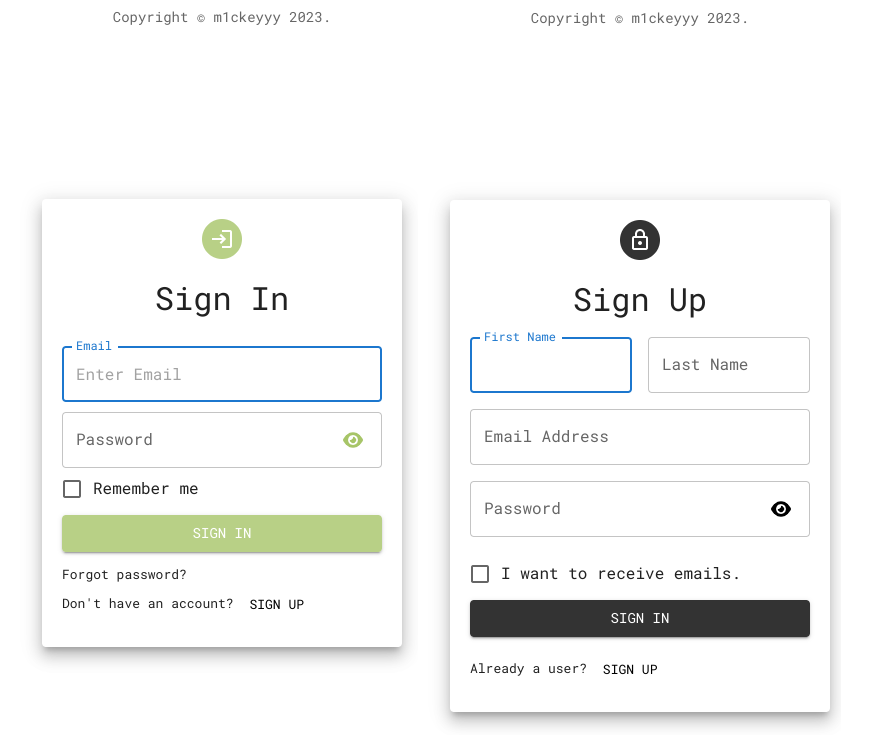

# Fullstack Habit Tracker App

This project is a simple login and registration web application built using Node.js, Express, and MongoDB.
It features a frontend implemented using HTML, CSS, and JavaScript, and a backend server that handles user authentication and stores user data in a MongoDB database.

## Requirements

- Node.js
- npm (included with Node.js)
- MongoDB

## Installation

1. Clone the repository

`git clone https://github.com/m1ckeyyy/habit-tracker.git`

2. Download packages

`cd client`
`cd server`

`npm install`

3. Set up your MongoDB Atlas account and create a new cluster.

4. Create a .env file in the root directory of the project and add the following variables, replacing the values with your own:

`MONGO_URI='mongodb+srv://<username>:<password>@<cluster-name>.mongodb.net/<database-name>?retryWrites=true&w=majority'
ACCESS_TOKEN_SECRET='<your-access-token-secret>'
PORT=<your-port-number>`

5. Start both servers.

`npx nodemon server`

`npm run dev`

## Usage

1. Open a web browser and go to http://localhost:8080
2. Click the "Register" button to create a new account, or the "Login" button to sign in with an existing account.
3. Enter your desired username and password, and click the "Submit" button.
4. If the login or registration was successful, you will be redirected to the home page.
5. To log out, simply close the browser or navigate to a different website.

#### License: [MIT](https://github.com/m1ckeyyy/habit-tracker/blob/master/LICENSE)

